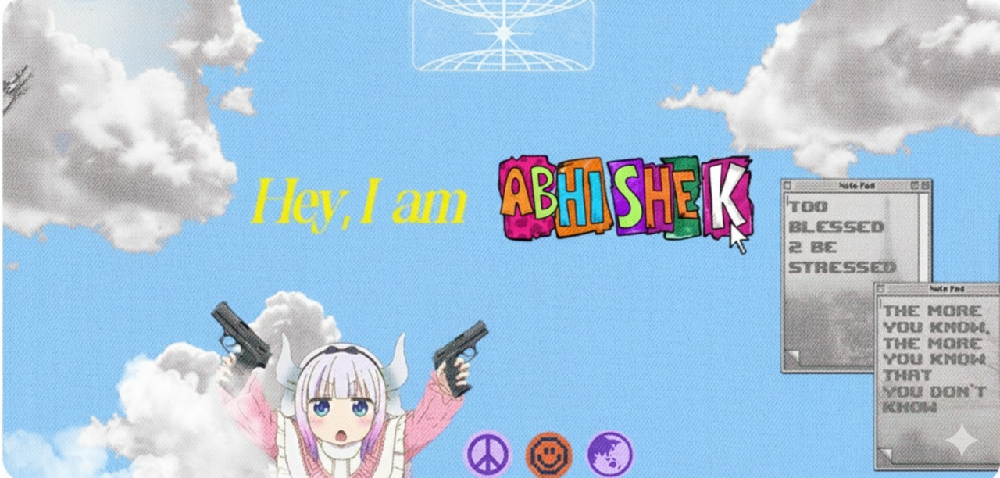

   
  ಕನ್ನಡಿಗ💛❤️
  

**<h4 align="center">`Aspiring to solve real world problems and become a Technically Sound Engineer ✨`**  

<pre align="center">
   💼 B.E in AIML @ NMIT
   💻 Software Developer • Web Designer
   🌎 Based in India 🇮🇳
   🚀 Building, Learning, and Collaborating on Open Source
   🎮 Music • Games • Code 
   ➡️ When I am not coding, you’ll probably find me outdoors.
</pre>
</h4>

  

* 🌱 I’m currently learning **Java, DSA, and Web Development**
* 🤝 Looking to collaborate with **Engineers, App Developers, and Designers**
* 👨‍💻 Working on **Software Development & Web Design**
* ⚡ Fun fact: **Learner • Coder • Team Builder • Innovative**
* 📫 Reach me at **[abhishekjc679@gmail.com](mailto:abhishekjc679@gmail.com)**

 

<h3 align="left">🌐 Connect with me:</h3>

---

### 💻 Tech Stack

### 🛠 Tools & Platforms

---

### 📊 GitHub Stats

 
 

---

### ✍️ Random Dev Quote

---

##### If you have any questions, suggestions, or just want to say hi, feel free to reach out — I’ll be happy to meet you. Peace ✌️  

 

